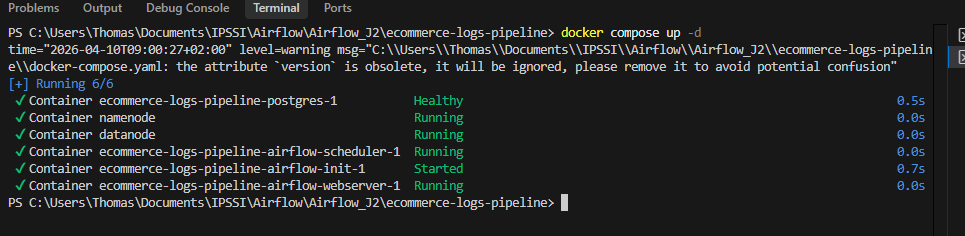
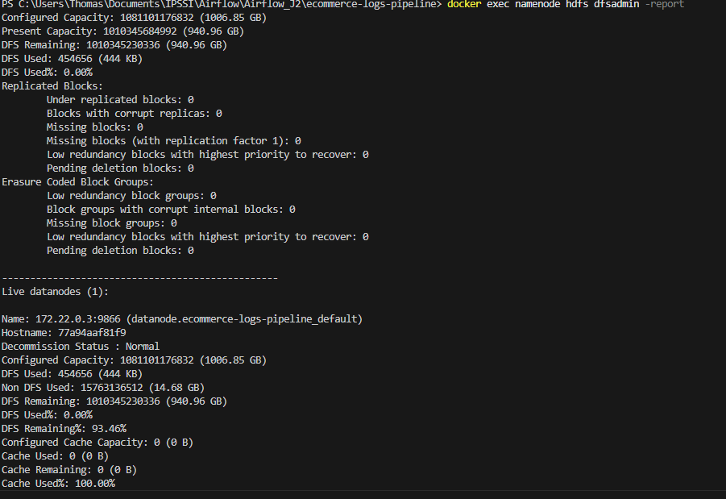
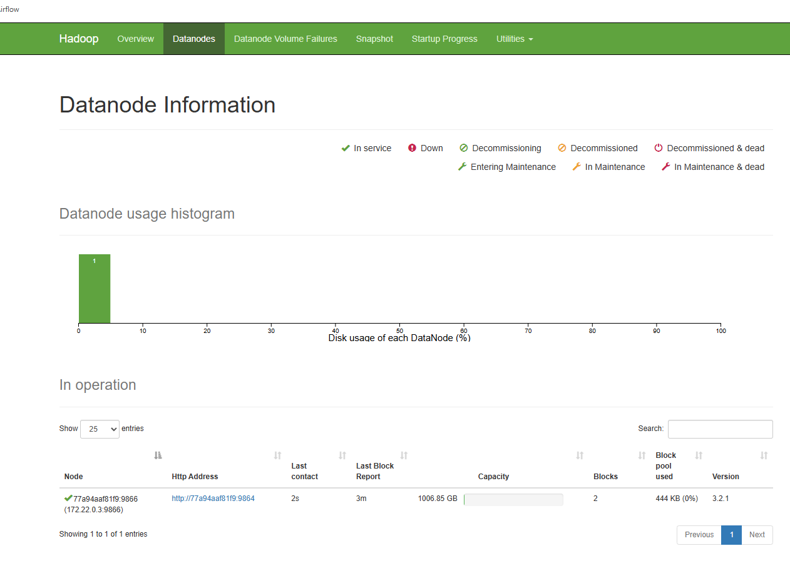
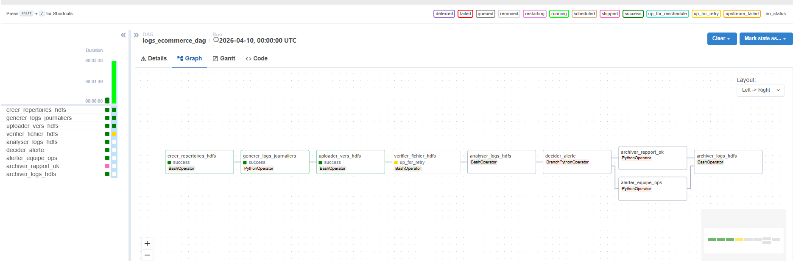
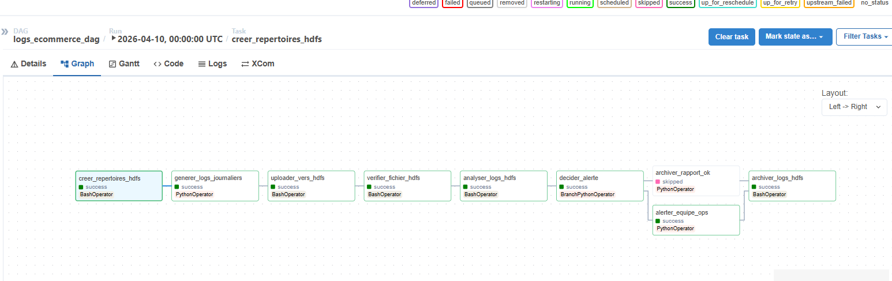
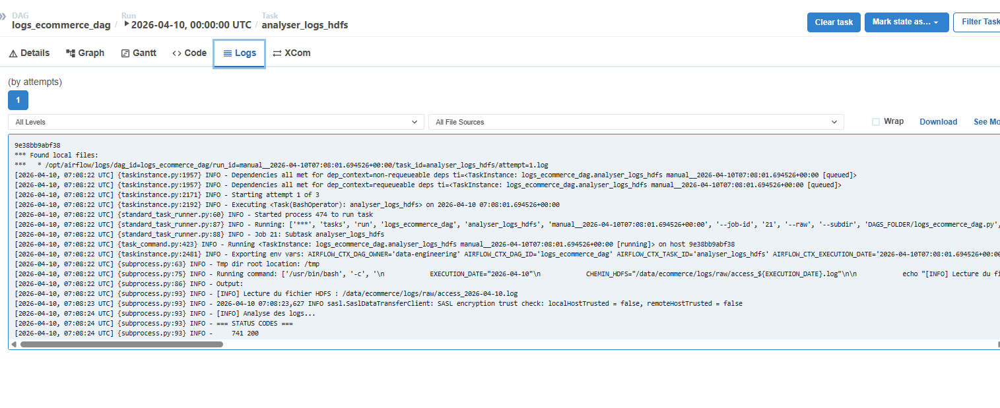
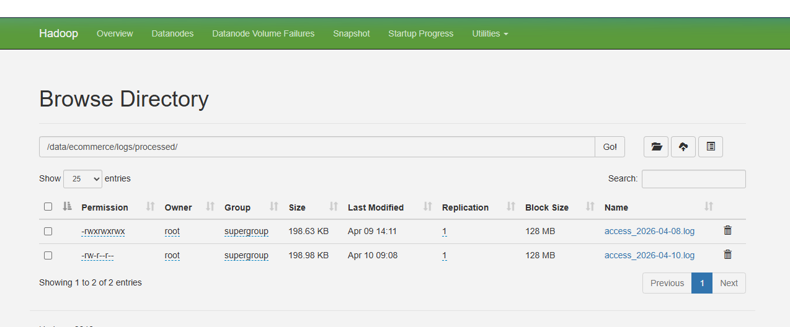

# TP Jour 2 — Réponses et Captures d'écran

## Q1 — HDFS vs système de fichiers local
**Pourquoi ne pas simplement stocker les logs sur le disque local du serveur Airflow ou sur un NFS ? Listez 3 avantages concrets de HDFS pour un cas d’usage de 50 Go/jour de logs, en vous appuyant sur les caractéristiques du système (distribution, réplication, localité des données).**

1. Tolérance aux pannes et Scalabilité 

## Q2 — NameNode, point de défaillance unique (SPOF)
**Dans l’architecture HDFS, le NameNode est un SPOF. Si le NameNode tombe, que se passe-t-il pour les DataNodes et pour les clients ? Quels mécanismes Hadoop propose-t-il pour pallier ce problème en production (HDFS NameNode HA) ? Quel est le rôle du Journal Node dans cette architecture haute disponibilité ?**

## Q3 — HdfsSensor vs polling actif
**Comparez le HdfsSensor en mode poke et en mode reschedule. Dans quel cas utiliseriez-vous l’un plutôt que l’autre ? Quel est l’impact sur le nombre des slots de workers Airflow disponibles ? Proposez un scénario concret où le mauvais choix de mode bloquerait tout le scheduler.**

- **Poke** : Le worker occupe un slot Airflow en continu pendant tout le precessus
- **Reschedule** : Le worker libère le slot entre deux vérifications

## Q4 — Réplication HDFS et cohérence des données
**Dans le hadoop.env, on a HDFS_CONF_dfs_replication=1 (réplication minimale). En production avec un facteur de réplication de 3, expliquez ce qui se passe lors de l’écriture d’un bloc de 128 Mo : combien de copies sont écrites, sur combien de DataNodes, et dans quel ordre ? Que garantit HDFS en termes de cohérence lors d'une lecture concurrente ?**

- **Processus** : 3 copies sont écrites sur 3 DataNodes différents.
- **Ordre** : Le client écrit sur le DN1, qui pousse au DN2, qui pousse au DN3. La validation remonte la chaîne seulement quand la copie est sécurisée sur les 3 nœuds.

---

## Captures d'écran

### 1. `docker compose ps` — tous les conteneurs running/healthy

### 2. `docker exec namenode hdfs dfsadmin -report` — 1 DataNode Live

### 3. Interface Web HDFS (localhost:9870) — Browse Directory `/data/ecommerce/logs/raw/`

### 4. Airflow UI — Vue Graph du DAG avec les 8 tâches

### 5. Airflow UI — Exécution complète avec les 2 branches (une verte, une grisée)

### 6. Logs de `analyser_logs_hdfs` — status codes et Top 5 URLs

### 7. Interface Web HDFS — fichier dans `/data/ecommerce/logs/processed/`

